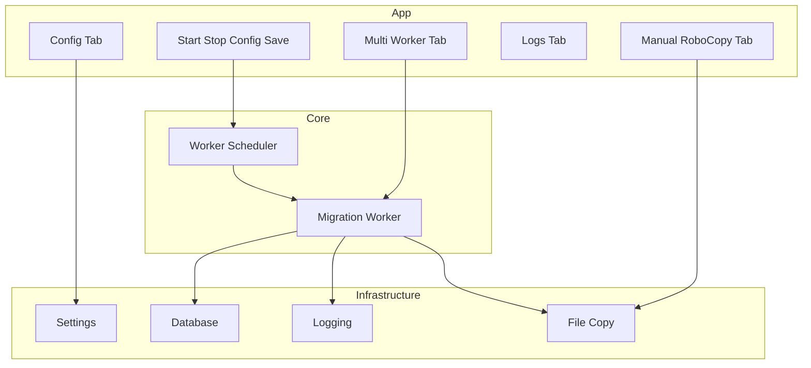

# RecFileMigrationTool — 개발 개요

> **읽기:** [`Rules.md`](../00_rules/Rules.md) → **본 문서** → [`TASK-INDEX.md`](../02_tasks/TASK-INDEX.md)  
> 구현 How는 [`ImplementationPrinciples.md`](../00_rules/ImplementationPrinciples.md) + RESULT 참조.

---

## 1. 프로그램 정체

| 항목 | 설명 |
|------|------|
| 목적 | Source DB의 미처리 녹취 메타를 조회 → NAS 파일을 Target으로 복사 → Source DB **Row 단위 즉시 마킹** |
| 형태 | 단일 WinForms EXE, **Multi-Worker** 병렬 + **스케줄러** |
| 규모 전제 | ~130TB, ~1억 건, **디렉터리 스캔 금지** |
| greenfield | `src/App` · `Core` · `Infrastructure` 분리 ([ImplementationPrinciples](../00_rules/ImplementationPrinciples.md)) |

---

## 2. 논리 아키텍처 (What)

---

## 3. 활성 기능 (14)

| ID | 기능 | Task |
|----|------|------|
| F-01 | 앱 시작, 네트워크 연결 제한 등 부트스트랩 | TASK-001 |
| F-02 | 설정(INI) 읽기/쓰기, Config 탭 | TASK-002 |
| F-03 | 스케줄러: Runtime 내 체크된 Worker 자동 기동 | TASK-003 |
| F-04 | Source DB 연결·인증·조회 설정 | TASK-004 |
| F-05 | Impact360/Audiolog/Target 경로·Mapping | TASK-005 |
| F-06 | Worker Row UI: 추가·삭제·선택·2열 배치 | TASK-006 |
| F-07 | Worker 시작/중지·스케줄러 연동 | TASK-007 |
| F-08 | Worker: 미처리 Row Batch 조회 루프 | TASK-008 |
| F-09 | Row → 소스/타겟 파일 경로 | TASK-009 |
| F-10 | 파일 복사, 예외 분류, DB 마킹 | TASK-010 |
| F-11 | Runtime·배치 Interval·협력적 중지 | TASK-011 |
| F-12 | Worker 상태·누적 통계·INI (**UI 멈춤 없음**) | TASK-012 |
| F-13 | 메인/Worker 로그, 전체 현황 리포트 | TASK-013 |
| F-14 | Manual RoboCopy 실행·리포트 | TASK-014 |

---

## 4. Non-Goals

- KMS / MediaParser / 암호화
- 레거시 단일 스레드 배치
- Target DB UI, 디렉터리 스캔, StatusReader UI

---

## 5. KB 관계

[`kb_migration_cursor_md/`](../kb_migration_cursor_md/)는 **신규 설계 목표** (.NET 8, Bulk Update, Dashboard, Bandwidth 등).

- TASK = **현행 관측 가능한 행위(What)**
- KB = **향후 개선**; 충돌 시 KB 우선, 차이는 RESULT에 기록
- TASK-INDEX §4 KB 매핑표 참조

---

## 6. 마킹 코드표 (공통)

| 코드 | 의미 |
|------|------|
| (설정값) | 복사 성공 (기본 `1`) |
| `2` | 파일/폴더 없음 |
| `5` | 복사 실패·기타 오류 |
| `6` | 1KB 이하 파일 |

---

## 7. INI 섹션 (공통)

| 섹션 | 용도 |
|------|------|
| `[General]` | Title, Log, ConnectionLimit, Worker flush/stats 간격 |
| `[WorkInfo]` | Site, Interval, Weekday/Weekend Runtime, RunAutoStart |
| `[DBInfoSource]` | Source DB, Table, MarkField, SelectCondition |
| `[PathInfo]` | I360 field, Audiolog, Target, Backup |
| `[PathMapping_n]` | Virtual → Real Source |
| `[Workers]` / `[Worker_n]` | Worker 목록·Row 설정·누적 통계 |
| `[ManualRoboCopy]` | RoboCopy 수동 실행 설정 |

상세 키는 각 TASK §5.
