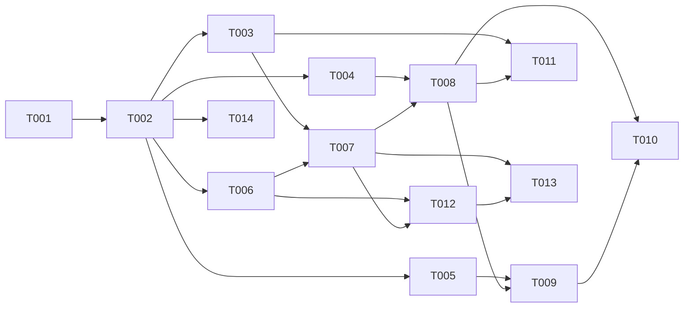

# TASK-INDEX — RecFileMigrationTool (14 Task)

> **구현 세션:** Rules + ImplementationPrinciples + **본 문서** + **TASK 1개**  
> **2026-07-01:** Task 본문을 **행위(What) 중심 8항목**으로 재작성. How는 RESULT.

---

## 1. Task 목록

| Task ID | 파일 | F-xx | 선행 | KB |
|---------|------|------|------|-----|
| TASK-001 | [TASK-001](TASK-001_프로그램_시작_및_공통초기화.md) | F-01 | — | [02](../kb_migration_cursor_md/02_architecture_design.md) |
| TASK-002 | [TASK-002](TASK-002_INI_설정_및_Config탭.md) | F-02 | 001 | [02](../kb_migration_cursor_md/02_architecture_design.md) |
| TASK-003 | [TASK-003](TASK-003_Worker_스케줄러.md) | F-03 | 002 | [04](../kb_migration_cursor_md/04_worker_parallel_processing.md) |
| TASK-004 | [TASK-004](TASK-004_Source_DB_설정.md) | F-04 | 002 | [03](../kb_migration_cursor_md/03_db_based_file_processing.md), [05](../kb_migration_cursor_md/05_db_bulk_update_and_bottleneck.md) |
| TASK-005 | [TASK-005](TASK-005_경로_설정_및_PathMapping.md) | F-05 | 002 | [03](../kb_migration_cursor_md/03_db_based_file_processing.md) |
| TASK-006 | [TASK-006](TASK-006_Multi_Worker_UI.md) | F-06 | 002 | [04](../kb_migration_cursor_md/04_worker_parallel_processing.md), [07](../kb_migration_cursor_md/07_dashboard_ui_design.md), [08](../kb_migration_cursor_md/08_operator_ux_requirements.md) |
| TASK-007 | [TASK-007](TASK-007_Worker_시작중지_오케스트레이션.md) | F-07 | 003, 006 | [04](../kb_migration_cursor_md/04_worker_parallel_processing.md) |
| TASK-008 | [TASK-008](TASK-008_Worker_DB조회_배치루프.md) | F-08 | 004, 007 | [03](../kb_migration_cursor_md/03_db_based_file_processing.md), [05](../kb_migration_cursor_md/05_db_bulk_update_and_bottleneck.md) |
| TASK-009 | [TASK-009](TASK-009_파일경로_생성.md) | F-09 | 005, 008 | [03](../kb_migration_cursor_md/03_db_based_file_processing.md) |
| TASK-010 | [TASK-010](TASK-010_파일복사_예외처리_마킹.md) | F-10 | 008, 009 | [03](../kb_migration_cursor_md/03_db_based_file_processing.md), [05](../kb_migration_cursor_md/05_db_bulk_update_and_bottleneck.md) |
| TASK-011 | [TASK-011](TASK-011_Runtime_Interval_제어.md) | F-11 | 003, 008 | [04](../kb_migration_cursor_md/04_worker_parallel_processing.md) |
| TASK-012 | [TASK-012](TASK-012_Worker_상태_UI_통계_INI저장.md) | F-12 | 006, 007 | [07](../kb_migration_cursor_md/07_dashboard_ui_design.md), [08](../kb_migration_cursor_md/08_operator_ux_requirements.md) |
| TASK-013 | [TASK-013](TASK-013_로그_및_전체현황_리포트.md) | F-13 | 007, 012 | [08](../kb_migration_cursor_md/08_operator_ux_requirements.md) |
| TASK-014 | [TASK-014](TASK-014_Manual_RoboCopy.md) | F-14 | 002 | — |

---

## 2. 의존성



---

## 3. 권장 구현 순서

001 → 002 → (004,005,006,014 병렬) → 003 → 007 → 008 → (009,010,011) → 012 → 013

---

## 4. KB 매핑

| KB | Task | 비고 |
|----|------|------|
| 02 | 001, 002 | Orchestrator·DI 목표 |
| 03 | 004~010 | DB 기반 파일 처리 |
| 04 | 003, 006, 007, 011 | Worker·스케줄 |
| 05 | 004, 008, 010 | **차이:** 현재 Row UPDATE |
| 06 | — | Bandwidth (신규 전용) |
| 07, 08 | 006, 012, 013 | Dashboard·UX |
| 10 | REVIEW | 해당 F-xx만 발췌 |

---

## 5. Task 작성·갱신

1. `_analysis/legacy_behavior/`에서 행위 추출 (**구현 세션 금지**)
2. [`Templates.md`](../00_rules/Templates.md) 8항목으로 TASK 작성
3. RESULT에 How 기록

---

## 6. AI 세션 지시 예

```text
Rules.md, ImplementationPrinciples.md, TASK-010만 읽고 greenfield 구현.
레거시 소스·_analysis 로드 금지. 완료 후 RESULT-010에 UI–Worker 연동 방식 기록.
```
